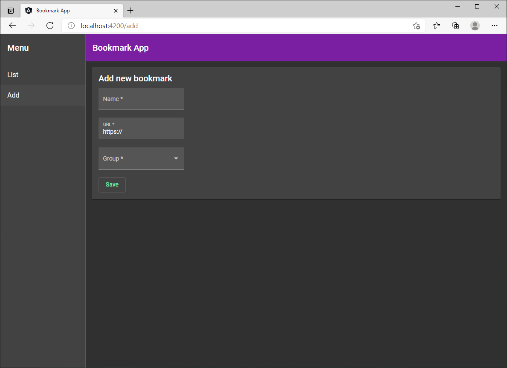
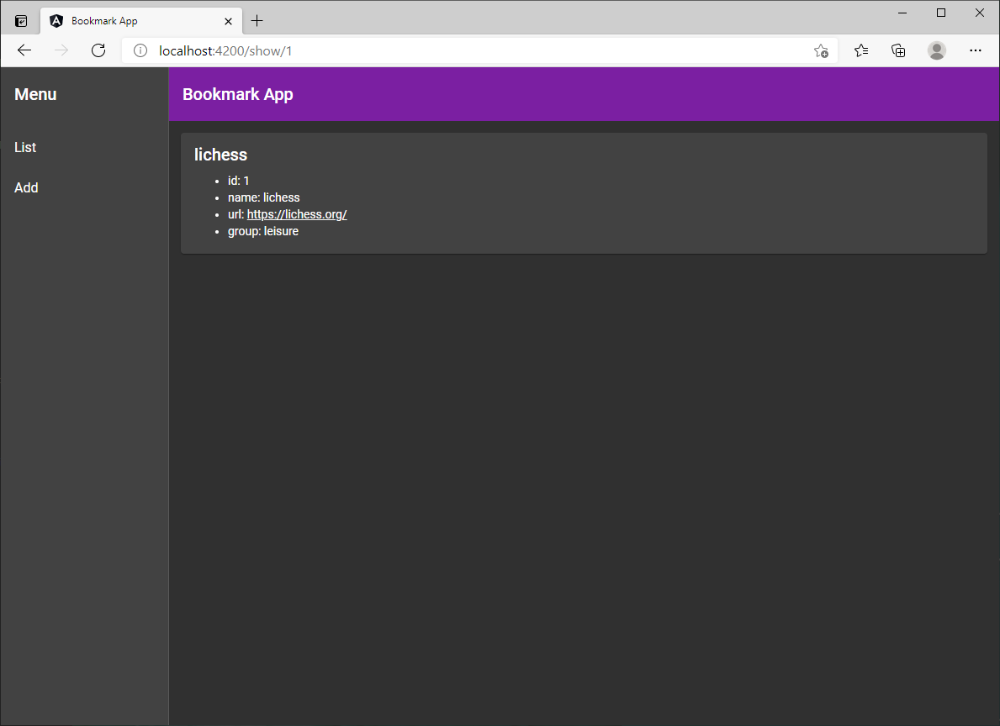
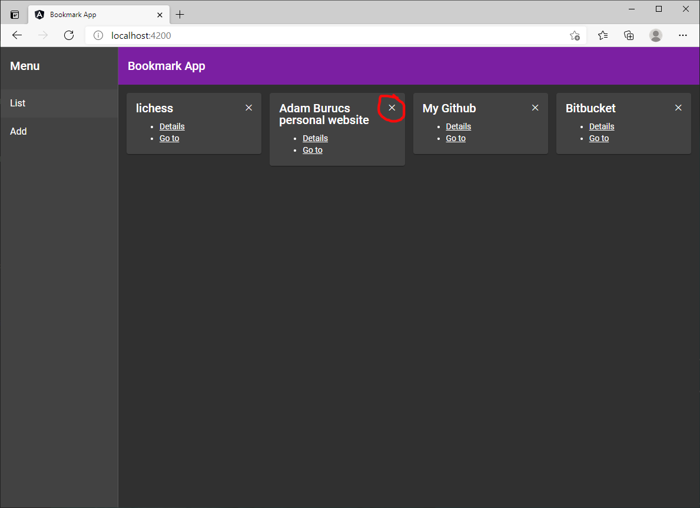

# Bookmark App

With this app, you can handle bookmarks.

- list
- save
- delete
- show details

This app has some default bookmarks, which are shown on startup. When reloading the page, the defaults are loaded again.

## How to use

1. Install: `npm install`
1. Run: `ng serve`
1. Open the default address in your browser: `http://localhost:4200/`
1. You can run tests by using: `ng test`

## Release notes

### July, 2024

Updated to **Angular v18**. Tested on Windows 11 Home.

### November, 2023

Updated to **Angular v17**. Tested on Windows 11 Home.

### March, 2021

Tested with **Node.js v14.15.0** on Windows 10 Home. Made with

- **Angular v11.2.5**
- **Angular Material**
- **NGRX**.

The first version was made in March 21st, 2021.

## Bonus features

The site is fully responsive. The list page uses using **CSS** Grid Layout\*\* with _auto-fill_ feature.

## List

Here we can see the bookmarks ordered by group.

## Add

The user can add a new bookmark.

## Details

This page shows the details of the bookmark.

## Delete

The user can delete a bookmark when clicking on ✕.

## License

Please see [the LICENSE file](LICENSE).
